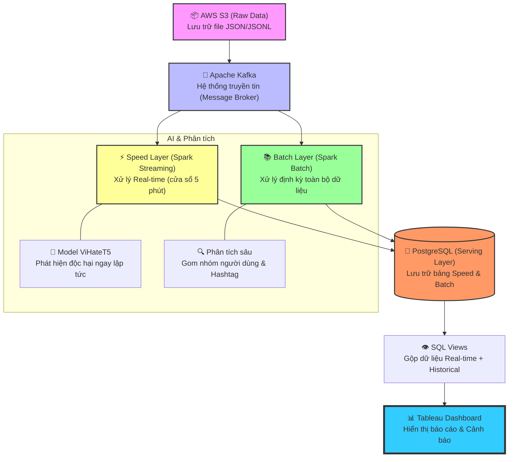

# TikTok Toxicity Monitoring - Kiến Trúc Lambda

Dự án phân tích độc tính (toxicity/hate speech) trên dữ liệu TikTok sử dụng kiến trúc Lambda với Apache Spark, Kafka và PostgreSQL.

## 🚀 Quick Start với UV

### 1. Cài đặt UV (nếu chưa có)

```bash
# MacOS/Linux
curl -LsSf https://astral.sh/uv/install.sh | sh

# Hoặc với Homebrew
brew install uv

# Kiểm tra
uv --version
```

### 2. Setup Environment

```bash
# Clone project
git clone <repo-url>
cd tiktok-lambda-toxicity

# Tạo virtual environment và install dependencies
uv venv .venv
source .venv/bin/activate  # hoặc ./activate.sh
uv pip install -r requirements.txt

# Hoặc sử dụng script
./activate.sh
```

### 3. Start Infrastructure

```bash
# Start Kafka + PostgreSQL + Kafka UI
docker compose up -d

# Initialize database
./scripts/init_db.sh
```

### 4. Test Pipeline

```bash
# Generate sample data
uv run python scripts/generate_sample_data.py

# Run ingestion (Kafka Producer)
uv run python src/ingestion/json_to_kafka.py

# Run speed layer (Streaming)
./scripts/start_streaming.sh

# Query results
psql -h localhost -U tiktok_user -d tiktok_toxicity
SELECT * FROM serving_video_stats LIMIT 5;
```

## 🏗️ Kiến Trúc



### Lambda Architecture Components

1. **Ingestion Layer**: Đọc file JSON/JSONL → Kafka topic `tiktok-raw`
2. **Speed Layer**: Spark Structured Streaming → xử lý realtime (window 5 phút)
3. **Batch Layer**: Spark Batch job chạy hàng ngày lúc 2h sáng (cron)
4. **Serving Layer**: PostgreSQL views merge batch + speed data
5. **Model**: ViHateT5-HSD (Vietnamese Hate Speech Detection)

## 📁 Cấu Trúc Thư Mục

```
tiktok-lambda-toxicity/
├── README.md
├── pyproject.toml          # UV project config
├── uv.lock                # UV lock file
├── requirements.txt        # Legacy pip requirements
├── activate.sh            # Activate virtual environment
├── deactivate.sh          # Deactivate virtual environment
├── docker-compose.yml      # Infrastructure setup
├── config/
│   └── config.yaml         # Application config
├── src/
│   ├── ingestion/
│   │   └── json_to_kafka.py     # Kafka Producer
│   ├── speed_layer/
│   │   └── streaming_toxicity.py # Spark Streaming
│   ├── batch_layer/
│   │   └── batch_full_recompute.py # Spark Batch
│   ├── models/
│   │   └── toxicity_detector.py  # ViHateT5 wrapper
│   └── utils/
│       └── db_utils.py           # PostgreSQL utilities
├── scripts/
│   ├── generate_sample_data.py   # Sample data generator
│   ├── start_streaming.sh        # Start Speed Layer
│   ├── run_batch.sh              # Run Batch Layer
│   ├── setup_cron.sh             # Setup cron job
│   └── init_db.sh                # Initialize database
├── sql/
│   └── serving_views.sql         # PostgreSQL schema + views
├── data/
│   ├── raw/                      # Input JSONL files
│   ├── processed/                # Processed files
│   ├── failed/                   # Failed files
│   └── archive/                  # Historical data
├── checkpoints/
│   ├── speed/                    # Speed Layer checkpoints
│   └── batch/                    # Batch Layer checkpoints
└── .venv/                        # UV virtual environment
```

## 🛠️ Development với UV

### Lệnh UV phổ biến

```bash
# Tạo virtual environment
uv venv .venv

# Activate environment
source .venv/bin/activate
# hoặc ./activate.sh

# Install dependencies
uv pip install -r requirements.txt

# Add new dependency
uv pip install package-name

# Install from pyproject.toml
uv pip install -e .

# Run scripts
uv run python scripts/generate_sample_data.py

# Upgrade dependencies
uv pip install --upgrade transformers torch

# Show installed packages
uv pip list

# Export requirements (nếu cần)
uv pip freeze > requirements.txt

# Deactivate
deactivate
# hoặc ./deactivate.sh
```

### So sánh UV vs pip/venv

| Feature | UV | pip + venv |
|---------|----|------------|
| **Speed** | ⚡ **Very fast** | 🐌 Slow |
| **Disk usage** | 📦 **Shared cache** | 💾 Duplicate packages |
| **Commands** | 🔧 Few commands | 📚 Many tools |
| **Lock file** | ✅ Automatic | ❌ Manual |
| **Reproducibility** | ✅ Excellent | ⚠️ Good |

## 🚀 Công Nghệ

- **Python 3.8+**
- **Apache Spark 3.5+** (Structured Streaming + Batch)
- **Apache Kafka** (Message broker)
- **PostgreSQL** (Serving database)
- **Hugging Face Transformers** (ViHateT5-HSD model)
- **UV** (Fast Python package manager)
- **Docker Compose** (Dev environment)

## 🔧 Cài Đặt

### Setup với UV (Khuyến nghị)

```bash
# 1. Install UV
curl -LsSf https://astral.sh/uv/install.sh | sh

# 2. Clone và setup
git clone <repo-url>
cd tiktok-lambda-toxicity

# 3. Create environment và install
uv venv .venv
source .venv/bin/activate
uv pip install -r requirements.txt

# 4. Start infrastructure
docker compose up -d

# 5. Initialize database
./scripts/init_db.sh
```

### Setup với pip (Traditional)

```bash
# 1. Create venv
python3 -m venv venv
source venv/bin/activate

# 2. Install dependencies
pip install -r requirements.txt

# 3. Continue with steps 4-5 above
```

## 📊 Sử Dụng

### 1. Generate Sample Data

```bash
uv run python scripts/generate_sample_data.py
```

### 2. Run Ingestion Layer

```bash
uv run python src/ingestion/json_to_kafka.py
```

### 3. Run Speed Layer

```bash
./scripts/start_streaming.sh
```

### 4. Run Batch Layer

```bash
./scripts/run_batch.sh
```

### 5. Query Serving Views

```bash
psql -h localhost -U tiktok_user -d tiktok_toxicity
SELECT * FROM serving_video_stats LIMIT 10;
```

## 📈 Serving Layer Views

### Các Views cho Power BI

1. **`serving_video_stats`** - Merge batch + speed data cho video statistics
2. **`serving_hashtag_stats`** - Hashtag controversy ranking
3. **`serving_user_ranking`** - Top toxic users
4. **`serving_alerts`** - Real-time alerts (toxic_ratio > 0.7)
5. **`serving_top_toxic_videos`** - Top 100 toxic videos
6. **`serving_recent_activity`** - Last 24h summary

### Power BI Connection

```
Host: localhost
Port: 5432
Database: tiktok_toxicity
Username: powerbi_reader
Password: powerbi_read123
```

## 🧪 Testing

### Test Toxicity Detector

```bash
uv run python src/models/toxicity_detector.py
```

### Test Database Connection

```bash
uv run python src/utils/db_utils.py
```

### Monitor Kafka Topics

```bash
# List topics
docker exec -it kafka kafka-topics --bootstrap-server localhost:9092 --list

# Consume messages
docker exec -it kafka kafka-console-consumer \
  --bootstrap-server localhost:9092 \
  --topic tiktok-raw \
  --from-beginning
```

## 📊 Schema

### Input JSON Schema

```json
{
  "video_id": "video_12345",
  "caption": "Chia sẻ mẹo nấu ăn",
  "comments": [
    {
      "user_id": "user_001",
      "text": "Hay quá bạn ơi!",
      "created_at": "2024-01-01T10:00:00"
    }
  ],
  "hashtags": ["cooking", "food", "recipe"],
  "created_at": "2024-01-01T09:00:00"
}
```

### Output Tables

#### Speed Layer Tables
- `speed_video_stats` - Window-based video statistics
- `speed_alerts` - High toxicity alerts

#### Batch Layer Tables
- `batch_video_stats` - Historical video statistics
- `batch_hashtag_stats` - Hashtag statistics
- `batch_user_ranking` - User toxicity ranking

## 🔍 Monitoring

### Spark UI
- Speed Layer: http://localhost:4040
- Batch Layer: http://localhost:4040

### Kafka UI
- URL: http://localhost:8080
- Browse topics, messages, consumers

## ⚙️ Configuration

Chỉnh sửa `config/config.yaml`:

```yaml
kafka:
  bootstrap_servers: "localhost:9092"
  topic_raw: "tiktok-raw"

postgres:
  host: "localhost"
  port: 5432
  database: "tiktok_toxicity"

model:
  name: "tarudesu/ViHateT5-HSD"
  device: "cpu"  # hoặc "cuda" nếu có GPU

speed_layer:
  window_duration: "5 minutes"
  toxic_threshold: 0.4
```

## 🐛 Troubleshooting

### Lỗi Kafka Connection

```bash
# Check services
docker compose ps

# Restart if needed
docker compose restart
```

### Lỗi PostgreSQL Connection

```bash
# Check PostgreSQL
docker compose ps postgres
docker compose logs postgres

# Test connection
psql -h localhost -U tiktok_user -d tiktok_toxicity
```

### Lỗi Model Loading

Lần đầu chạy sẽ download model (~500MB). Cần internet connection.

### Lỗi Checkpoint

```bash
# Clear checkpoints
rm -rf checkpoints/speed/*
rm -rf checkpoints/batch/*
```

## 💡 Tips

- Speed Layer cần ~2GB RAM
- Batch Layer cần ~4GB RAM
- Model inference nhanh hơn với GPU (CUDA)
- Use Parquet format cho archive data (nhanh hơn JSON)

## 📝 TODO / Future Improvements

- [ ] Add ONNX model support cho faster inference
- [ ] Implement Kubernetes deployment
- [ ] Add Grafana dashboards
- [ ] Implement data retention policies
- [ ] Add API layer (FastAPI)
- [ ] Implement A/B testing for different models
- [ ] Add data quality checks
- [ ] Build admin dashboard

## 📄 License

MIT License

## 👥 Contributors

- [Your Name]

## 📚 References

- [ViHateT5-HSD Model](https://huggingface.co/tarudesu/ViHateT5-HSD)
- [Apache Spark Structured Streaming](https://spark.apache.org/docs/latest/structured-streaming-programming-guide.html)
- [Lambda Architecture](http://lambda-architecture.net/)
- [UV Documentation](https://docs.astral.sh/uv/)